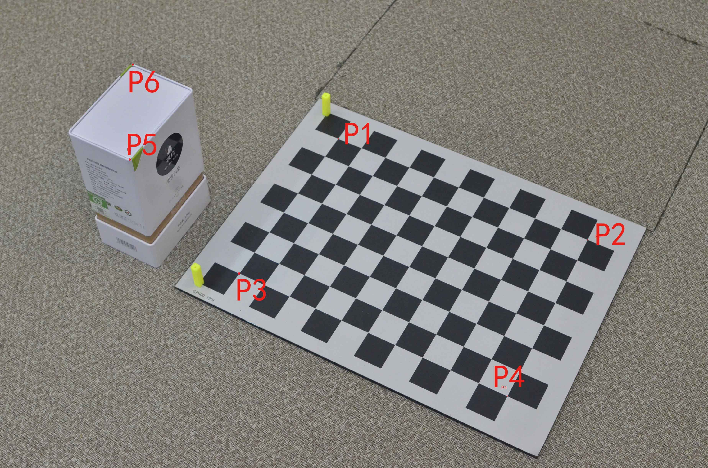

# 根据相机位姿求指定点的世界坐标及其python实现

****
| Author | shaniadolphin    |
| :----: | :--------------- |
| e-mail | 349948204@qq.com |

****

## 求解目的

&emsp;&emsp;本文将展示位姿估计的一种应用，即通过单目相机对环境进行测量。简单来说，本文的工作就是利用下面的两幅图，在已知P1、P2、P3、P4四点世界坐标的情况下，计算出其它点的世界坐标。

&emsp;&emsp;如图所示，一个标准的标定板，标定板每个格子的尺寸是30mm，通过标定四周的4个点P1、P2、P3、P4，旁边有茶罐，有待求点为**P5、P6**。



&emsp;&emsp;这种应用可以利用一个已经尺寸物体，通过两张不同视角的照片求未知物体的尺寸。比如上图中的通过已知的标定板求茶罐的尺寸。而在现实应用中可以用这种方式来求车的尺寸，建筑的高度，货物的体积等等。

## 求解原理

&emsp;&emsp;如下图，根据P1、P2、P3、P4四点的空间坐标，通过openCV的PNP函数，可以计算出两次拍照的相机位姿，从而进一步计算出相机的坐标$Oc_1$与$Oc_2$。那么将$Oc_1$与$P$，$Oc_2$与$P$连成直线，获得两条直线方程$A$和$B$，组成方程组求解得到它们的交点，即为待求目标点的坐标。


### 1. 求出$P$点的相机坐标系坐标$P_c$

&emsp;&emsp;关于P点如何从二维映射到三维，参考上图，$O_c$的坐标通过解$PNP$已经求出，待求点P在图像中的像素坐标为$(u,v)$。

&emsp;&emsp;求出$P$在相机坐标系中的坐标$P_c$（也就是上图中的$P_c$点）。具体的转换公式如下，式中$f$为相机镜头的焦距$(mm)$，在本次实验中使用的是中一光学的35mm手动镜头。$(u,v)$为点的像素坐标，其余为相机内参数。
$$
\begin{cases}x_c=(u-u_0)*f/f_x \\y_c=(v-v_0)*f/f_y \\z_c=f \end{cases}
$$
&emsp;&emsp;输入拍到的图片的点，包括待求点的像素坐标，示例如下：

```python
    P11 = np.array([0, 0, 0])
    P12 = np.array([0, 300, 0])
    P13 = np.array([210, 0, 0])
    P14 = np.array([210, 300, 0])    
    p11 = np.array([1765, 725])
    p12 = np.array([3068, 1254])
    p13 = np.array([1249, 1430])
    p14 = np.array([2648, 2072]) 
    p4psolver1.Points3D[0] = np.array([P11,P12,P13,P14])
    p4psolver1.Points2D[0] = np.array([p11,p12,p13,p14])
    #p4psolver1.point2find = np.array([4149, 671])
    #p4psolver1.point2find = np.array([675, 835])
    p4psolver1.point2find = np.array([691, 336])    
```

&emsp;&emsp;读取标定文件中的相机内参，代码如下，在代码里预设了相机的传感器大小，笔者所用的D7000单反是DX画幅的，根据可查到的资料，传感器的规格为23.6mm*15.6mm。

&emsp;&emsp;笔者用在本机的镜头是中一的35mm手动定焦镜头。

```python
    def getudistmap(self, filename):
        with open(filename, 'r',newline='') as csvfile:
            spamreader = csv.reader(csvfile, delimiter=',', quotechar='"')
            rows = [row for row in spamreader]
            self.cameraMatrix = np.zeros((3, 3))
            #Dt = np.zeros((4, 1))
            size_w = 23.6
            size_h = 15.6
            imageWidth = int(rows[0][1])
            imageHeight = int(rows[0][2])
            self.cameraMatrix[0][0] = rows[1][1]
            self.cameraMatrix[1][1] = rows[1][2]
            self.cameraMatrix[0][2] = rows[1][3]
            self.cameraMatrix[1][2] = rows[1][4]
            self.cameraMatrix[2][2] = 1
            print(len(rows[2]))
            if len(rows[2]) == 5:
                print('fisheye')
                self.distCoefs = np.zeros((4, 1))
                self.distCoefs[0][0] = rows[2][1]
                self.distCoefs[1][0] = rows[2][2]
                self.distCoefs[2][0] = rows[2][3]
                self.distCoefs[3][0] = rows[2][4]
                scaled_K = self.cameraMatrix * 0.8 # The values of K is to scale with image dimension.
                scaled_K[2][2] = 1.0 
                #newcameramtx = cv2.fisheye.estimateNewCameraMatrixForUndistortRectify(self.cameraMatrix, self.distCoefs, (imageWidth, imageHeight), np.eye(3), balance=0)
                #map1, map2 = cv2.fisheye.initUndistortRectifyMap(self.cameraMatrix, self.distCoefs, np.eye(3), newcameramtx, (imageWidth, imageHeight), cv2.CV_32FC1)                     
            else:
                print('normal')
                self.distCoefs = np.zeros((1, 5))
                self.distCoefs[0][0] = rows[2][1]
                self.distCoefs[0][1] = rows[2][2]
                self.distCoefs[0][2] = rows[2][3]
                self.distCoefs[0][3] = rows[2][4]
                self.distCoefs[0][4] = rows[2][5]
                #newcameramtx, roi = cv2.getOptimalNewCameraMatrix(self.cameraMatrix, self.distCoefs, (imageWidth, imageHeight), 1, (imageWidth, imageHeight))
                #map1, map2 = cv2.initUndistortRectifyMap(self.cameraMatrix, self.distCoefs, None, newcameramtx, (imageWidth, imageHeight), cv2.CV_32FC1)        
            print('dim = %d*%d'%(imageWidth, imageHeight))
            print('Kt = \n', self.cameraMatrix)
            #print('newcameramtx = \n', newcameramtx)
            print('Dt = \n', self.distCoefs)
            self.f = [self.cameraMatrix[0][0]*(size_w/imageWidth), self.cameraMatrix[1][1]*(size_h/imageHeight)]
            #self.f = [350, 350]
            print('f = \n', self.f)
            #print(map1,'\n',map2.T)
            return
```

&emsp;&emsp;然后就可以将像素坐标转换到世界坐标了：

```python
    def WordFrame2ImageFrame(self, WorldPoints):
        pro_points, jacobian = cv2.projectPoints(WorldPoints, self.rvecs, self.tvecs, self.cameraMatrix, self.distCoefs)
        return pro_points

    def ImageFrame2CameraFrame(self, pixPoints):
        fx = self.cameraMatrix[0][0]
        u0 = self.cameraMatrix[0][2]
        fy = self.cameraMatrix[1][1]
        v0 = self.cameraMatrix[1][2]
        zc = (self.f[0]+self.f[1])/2
        xc = (pixPoints[0] - u0) * self.f[0] / fx  #f=fx*传感器尺寸/分辨率
        yc = (pixPoints[1] - v0) * self.f[1] / fy
        point = np.array([xc,yc,zc])
        return point
```


### 2.求出P点在世界坐标系中的方向向量

&emsp;&emsp;通过以上运算得到了$P_c(x_c,y_c,z_c)$，但这个点坐标是在相机坐标系中的，需要进一步求解$P$点在世界坐标系中对应的坐标$P_w(x_w,y_w,c_w)$。

&emsp;&emsp;为了将$P_c$转为$P_w$，即求出原点$O_w$在相机坐标系下的坐标，需要使用到解$PNP$求位姿时得到的三个欧拉角$\theta_x,\theta_y,\theta_z$。相机坐标系$C$按照$z$轴、$y$轴、$x$轴的顺序旋转以上角度后将与世界坐标系$W$完全平行，在这三次旋转中$P_c$也会与坐标系一起旋转的，其在世界系$W$中的位置会发生改变。为了保证$C$系旋转后$P$点依然保持在世界坐标系W原本的位置，需要对$P_c$进行三次反向旋转，旋转后得到点$P_c$在相机坐标系$C$中新的坐标值记为$P_c^{'}$，$P_c^{'}$的值等于世界坐标系中向量$OP$的值。最终，$P$点的世界坐标$P_w$=$P_c^{'}$的值+$Oc$的世界坐标值，具体操作如下：

##### 第一次旋转：

&emsp;&emsp;原始相机坐标系$C$绕$z$轴旋转了$\theta_z$变为$C_1$系，$P_0=(x_0,y_0,z_0)$，将$P$点绕$z$轴旋转$-\theta_z$，得到$P_1=(x_1,y_1,z_1)$，其为$C_1$系中$O_w$的坐标。

```python
    def CodeRotateByZ(self, x,  y,  thetaz):#将空间点绕Z轴旋转
        x1=x #将变量拷贝一次，保证&x == &outx这种情况下也能计算正确
        y1=y
        rz = thetaz*3.141592653589793/180
        outx = math.cos(rz)*x1 - math.sin(rz)*y1
        outy = math.sin(rz)*x1 + math.cos(rz)*y1
        return outx,outy
```

##### 第二次旋转：

&emsp;&emsp;$C_1$绕$y$轴旋转了$\theta_y$变为$C_2$系，$P_1=(x_1,y_1,z_1)$，将$P_1$点绕$y$轴旋转$-\theta_y$，得到$P_2=(x_2,y_2,z_2)$，其为$C_2$系中$O_w$的坐标。

```python
    def CodeRotateByY(self, x, z, thetay):
        x1=x
        z1=z
        ry = thetay * 3.141592653589793 / 180
        outx = math.cos(ry) * x1 + math.sin(ry) * z1
        outz = math.cos(ry) * z1 - math.sin(ry) * x1
        return outx,outz
```

##### 第三次旋转：

&emsp;&emsp;$C_2$绕$x$轴旋转了$\theta_x$变为$C_3$系，$P_2=(x_2,y_2,z_2)$，将$P_2$点绕$x$轴旋转$-\theta_x$，得到$P_3=(x_3,y_3,z_3)$，其为$C_3$系中$O_w$的坐标。

```python
    def CodeRotateByX(self, y, z, thetax):
        y1=y
        z1=z
        rx = (thetax * 3.141592653589793) / 180
        outy = math.cos(rx) * y1 - math.sin(rx) * z1
        outz = math.cos(rx) * z1 + math.sin(rx) * y1
        return outy,outz
```

&emsp;&emsp;此时，世界坐标系中，相机的位置坐标为$(-x_3,-y_3,-z_3)$。结合上面的旋转函数，完整的求解代码如下所示：

```python
    def solver(self):
        retval, self.rvec, self.tvec = cv2.solvePnP(self.Points3D, self.Points2D, self.cameraMatrix, self.distCoefs)
        #print('self.rvec:',self.rvec)
        #print('self.tvec:',self.tvec)
        thetax,thetay,thetaz = self.rotationVectorToEulerAngles(self.rvec, 0)
        x = self.tvec[0][0]
        y = self.tvec[1][0]
        z = self.tvec[2][0]
        self.Position_OwInCx = x
        self.Position_OwInCy = y
        self.Position_OwInCz = z
        self.Position_theta = [thetax, thetay, thetaz]
        #print('Position_theta:',self.Position_theta)
        x, y = self.CodeRotateByZ(x, y, -1 * thetaz)
        x, z = self.CodeRotateByY(x, z, -1 * thetay)
        y, z = self.CodeRotateByX(y, z, -1 * thetax)
        self.Theta_W2C = (-1*thetax, -1*thetay,-1*thetaz)
        self.Position_OcInWx = x*(-1)
        self.Position_OcInWy = y*(-1)
        self.Position_OcInWz = z*(-1)
        self.Position_OcInW = np.array([self.Position_OcInWx, self.Position_OcInWy, self.Position_OcInWz])
        print('Position_OcInW:', self.Position_OcInW)
```

&emsp;&emsp;通过世界坐标系的相机坐标a1，P点坐标a2，构成第一条直线A。

```python
    def SetLineA(self, A1x, A1y, A1z, A2x, A2y, A2z):
        self.a1 = np.array([A1x, A1y, A1z]) 
        self.a2 = np.array([A2x, A2y, A2z])
```


### 3. 最后，根据两幅图得到的两条直线，计算出P点的世界坐标

&emsp;&emsp;对另外一幅图也进行如上操作，获得两条直线A、B，因此求出两条直线A与B的交点即可求出目标点的世界坐标。然而在现实中，由于误差的存在，A与B基本不会相交，因此在计算时需要求他们之间的最近点。


```python
class GetDistanceOf2linesIn3D():
    def __init__(self):
        print('GetDistanceOf2linesIn3D class')

    def dot(self, ax, ay, az, bx, by, bz):
        result = ax*bx + ay*by + az*bz
        return result

    def cross(self, ax, ay, az, bx, by, bz):
        x = ay*bz - az*by
        y = az*bx - ax*bz
        z = ax*by - ay*bx
        return x,y,z

    def crossarray(self, a, b):
        x = a[1]*b[2] - a[2]*b[1]
        y = a[2]*b[0] - a[0]*b[2]
        z = a[0]*b[1] - a[1]*b[0]
        return np.array([x,y,z])

    def norm(self, ax, ay, az):
        return math.sqrt(self.dot(ax, ay, az, ax, ay, az))

    def norm2(self, one):
        return math.sqrt(np.dot(one, one))


    def SetLineA(self, A1x, A1y, A1z, A2x, A2y, A2z):
        self.a1 = np.array([A1x, A1y, A1z]) 
        self.a2 = np.array([A2x, A2y, A2z])

    def SetLineB(self, B1x, B1y, B1z, B2x, B2y, B2z):
        self.b1 = np.array([B1x, B1y, B1z])    
        self.b2 = np.array([B2x, B2y, B2z])

    def GetDistance(self):
        d1 = self.a2 - self.a1
        d2 = self.b2 - self.b1
        e = self.b1 - self.a1

        cross_e_d2 = self.crossarray(e,d2)
        cross_e_d1 = self.crossarray(e,d1)
        cross_d1_d2 = self.crossarray(d1,d2)

        dd = self.norm2(cross_d1_d2)
        t1 = np.dot(cross_e_d2, cross_d1_d2)
        t2 = np.dot(cross_e_d1, cross_d1_d2)

        t1 = t1/(dd*dd)
        t2 = t2/(dd*dd)

        self.PonA = self.a1 + (self.a2 - self.a1) * t1
        self.PonB = self.b1 + (self.b2 - self.b1) * t2

        self.distance = self.norm2(self.PonB - self.PonA)
        print('distance=', self.distance)
        return self.distance
```

## 总结与验证

&emsp;&emsp;通过以上的讲解，说明了大致的原理和过程。完整的求解代码及结果如下，其中代码中打开的“calibration.csv”是一个标定生成的文件，存取了笔者D7000标定后得到的内参，如表格清单所示。

&emsp;&emsp;表格清单：

| dim          | 3696             | 2448     |          |          |          |
| ------------ | ---------------- | -------- | -------- | -------- | -------- |
| cameraMatrix | 5546.18009098042 | 5572.883 | 1821.049 | 1347.461 |          |
| distCoefs    | -0.12735         | 0.200792 | -0.00209 | 0.000943 | -0.79439 |

&emsp;&emsp;代码清单：

```python
#!/usr/bin/env python3
# coding:utf-8
import cv2
import numpy as np
import time
from PIL import Image,ImageTk
import threading
import os
import re    
import subprocess
import random
import math
import csv
import argparse

class PNPSolver(): 
    def __init__(self):
        self.COLOR_WHITE = (255,255,255)
        self.COLOR_BLUE = (255,0,0)
        self.COLOR_LBLUE = (255, 200, 100)
        self.COLOR_GREEN = (0,240,0)
        self.COLOR_RED = (0,0,255)
        self.COLOR_DRED = (0,0,139)
        self.COLOR_YELLOW = (29,227,245)
        self.COLOR_PURPLE = (224,27,217)
        self.COLOR_GRAY = (127,127,127)  
        self.Points3D = np.zeros((1, 4, 3), np.float32)  #存放4组世界坐标位置
        self.Points2D = np.zeros((1, 4, 2), np.float32)   #存放4组像素坐标位置
        self.point2find = np.zeros((1, 2), np.float32)
        self.cameraMatrix = None
        self.distCoefs = None
        self.f = 0

    def rotationVectorToEulerAngles(self, rvecs, anglestype):
        R = np.zeros((3, 3), dtype=np.float64)
        cv2.Rodrigues(rvecs, R)
        sy = math.sqrt(R[2,1] * R[2,1] +  R[2,2] * R[2,2])
        singular = sy < 1e-6
        if  not singular:
            x = math.atan2(R[2,1] , R[2,2])
            y = math.atan2(-R[2,0], sy)
            z = math.atan2(R[1,0], R[0,0])
        else :
            x = math.atan2(-R[1,2], R[1,1])
            y = math.atan2(-R[2,0], sy)
            z = 0
        if anglestype == 0:
            x = x*180.0/3.141592653589793
            y = y*180.0/3.141592653589793
            z = z*180.0/3.141592653589793
        elif anglestype == 1:
            x = x
            y = y
            z = z
        print(x)
        return x,y,z

    def CodeRotateByZ(self, x,  y,  thetaz):#将空间点绕Z轴旋转
        x1=x #将变量拷贝一次，保证&x == &outx这种情况下也能计算正确
        y1=y
        rz = thetaz*3.141592653589793/180
        outx = math.cos(rz)*x1 - math.sin(rz)*y1
        outy = math.sin(rz)*x1 + math.cos(rz)*y1
        return outx,outy

    def CodeRotateByY(self, x, z, thetay):
        x1=x
        z1=z
        ry = thetay * 3.141592653589793 / 180
        outx = math.cos(ry) * x1 + math.sin(ry) * z1
        outz = math.cos(ry) * z1 - math.sin(ry) * x1
        return outx,outz

    def CodeRotateByX(self, y, z, thetax):
        y1=y
        z1=z
        rx = (thetax * 3.141592653589793) / 180
        outy = math.cos(rx) * y1 - math.sin(rx) * z1
        outz = math.cos(rx) * z1 + math.sin(rx) * y1
        return outy,outz

    def solver(self):
        retval, self.rvec, self.tvec = cv2.solvePnP(self.Points3D, self.Points2D, self.cameraMatrix, self.distCoefs)
        thetax,thetay,thetaz = self.rotationVectorToEulerAngles(self.rvec, 0)
        x = self.tvec[0][0]
        y = self.tvec[1][0]
        z = self.tvec[2][0]
        self.Position_OwInCx = x
        self.Position_OwInCy = y
        self.Position_OwInCz = z
        self.Position_theta = [thetax, thetay, thetaz]
        #print('Position_theta:',self.Position_theta)
        x, y = self.CodeRotateByZ(x, y, -1 * thetaz)
        x, z = self.CodeRotateByY(x, z, -1 * thetay)
        y, z = self.CodeRotateByX(y, z, -1 * thetax)
        self.Theta_W2C = ([-1*thetax, -1*thetay,-1*thetaz])
        self.Position_OcInWx = x*(-1)
        self.Position_OcInWy = y*(-1)
        self.Position_OcInWz = z*(-1)
        self.Position_OcInW = np.array([self.Position_OcInWx, self.Position_OcInWy, self.Position_OcInWz])
        print('Position_OcInW:', self.Position_OcInW)

    def WordFrame2ImageFrame(self, WorldPoints):
        pro_points, jacobian = cv2.projectPoints(WorldPoints, self.rvecs, self.tvecs, self.cameraMatrix, self.distCoefs)
        return pro_points

    def ImageFrame2CameraFrame(self, pixPoints):
        fx = self.cameraMatrix[0][0]
        u0 = self.cameraMatrix[0][2]
        fy = self.cameraMatrix[1][1]
        v0 = self.cameraMatrix[1][2]
        zc = (self.f[0]+self.f[1])/2
        xc = (pixPoints[0] - u0) * self.f[0] / fx  #f=fx*传感器尺寸/分辨率
        yc = (pixPoints[1] - v0) * self.f[1] / fy
        point = np.array([xc,yc,zc])
        return point

    def getudistmap(self, filename):
        with open(filename, 'r',newline='') as csvfile:
            spamreader = csv.reader(csvfile, delimiter=',', quotechar='"')
            rows = [row for row in spamreader]
            self.cameraMatrix = np.zeros((3, 3))
            #Dt = np.zeros((4, 1))
            size_w = 23.6
            size_h = 15.6
            imageWidth = int(rows[0][1])
            imageHeight = int(rows[0][2])
            self.cameraMatrix[0][0] = rows[1][1]
            self.cameraMatrix[1][1] = rows[1][2]
            self.cameraMatrix[0][2] = rows[1][3]
            self.cameraMatrix[1][2] = rows[1][4]
            self.cameraMatrix[2][2] = 1
            print(len(rows[2]))
            if len(rows[2]) == 5:
                print('fisheye')
                self.distCoefs = np.zeros((4, 1))
                self.distCoefs[0][0] = rows[2][1]
                self.distCoefs[1][0] = rows[2][2]
                self.distCoefs[2][0] = rows[2][3]
                self.distCoefs[3][0] = rows[2][4]
                scaled_K = self.cameraMatrix * 0.8 # The values of K is to scale with image dimension.
                scaled_K[2][2] = 1.0                   
            else:
                print('normal')
                self.distCoefs = np.zeros((1, 5))
                self.distCoefs[0][0] = rows[2][1]
                self.distCoefs[0][1] = rows[2][2]
                self.distCoefs[0][2] = rows[2][3]
                self.distCoefs[0][3] = rows[2][4]
                self.distCoefs[0][4] = rows[2][5]     
            print('dim = %d*%d'%(imageWidth, imageHeight))
            print('Kt = \n', self.cameraMatrix)
            print('Dt = \n', self.distCoefs)
            self.f = [self.cameraMatrix[0][0]*(size_w/imageWidth), self.cameraMatrix[1][1]*(size_h/imageHeight)]
            print('f = \n', self.f)
            return

class GetDistanceOf2linesIn3D():
    def __init__(self):
        print('GetDistanceOf2linesIn3D class')

    def dot(self, ax, ay, az, bx, by, bz):
        result = ax*bx + ay*by + az*bz
        return result

    def cross(self, ax, ay, az, bx, by, bz):
        x = ay*bz - az*by
        y = az*bx - ax*bz
        z = ax*by - ay*bx
        return x,y,z

    def crossarray(self, a, b):
        x = a[1]*b[2] - a[2]*b[1]
        y = a[2]*b[0] - a[0]*b[2]
        z = a[0]*b[1] - a[1]*b[0]
        return np.array([x,y,z])

    def norm(self, ax, ay, az):
        return math.sqrt(self.dot(ax, ay, az, ax, ay, az))

    def norm2(self, one):
        return math.sqrt(np.dot(one, one))


    def SetLineA(self, A1x, A1y, A1z, A2x, A2y, A2z):
        self.a1 = np.array([A1x, A1y, A1z]) 
        self.a2 = np.array([A2x, A2y, A2z])

    def SetLineB(self, B1x, B1y, B1z, B2x, B2y, B2z):
        self.b1 = np.array([B1x, B1y, B1z])    
        self.b2 = np.array([B2x, B2y, B2z])

    def GetDistance(self):
        d1 = self.a2 - self.a1
        d2 = self.b2 - self.b1
        e = self.b1 - self.a1

        cross_e_d2 = self.crossarray(e,d2)
        cross_e_d1 = self.crossarray(e,d1)
        cross_d1_d2 = self.crossarray(d1,d2)

        dd = self.norm2(cross_d1_d2)
        t1 = np.dot(cross_e_d2, cross_d1_d2)
        t2 = np.dot(cross_e_d1, cross_d1_d2)

        t1 = t1/(dd*dd)
        t2 = t2/(dd*dd)

        self.PonA = self.a1 + (self.a2 - self.a1) * t1
        self.PonB = self.b1 + (self.b2 - self.b1) * t2

        self.distance = self.norm2(self.PonB - self.PonA)
        print('distance=', self.distance)
        return self.distance


if __name__ == "__main__":
    print("***************************************")
    print("test example")
    print("***************************************")
    parser = argparse.ArgumentParser(description='test')
    parser.add_argument('-file', type=str, default = 'calibration.csv')
    args = parser.parse_args()
    calibrationfile = args.file

    p4psolver1 = PNPSolver()
    '''
    P11 = np.array([0, 0, 0])
    P12 = np.array([0, 200, 0])
    P13 = np.array([150, 0, 0])
    P14 = np.array([150, 200, 0])
    p11 = np.array([2985, 1688])
    p12 = np.array([5081, 1690])
    p13 = np.array([2997, 2797])
    p14 = np.array([5544, 2757])
    '''
    P11 = np.array([0, 0, 0])
    P12 = np.array([0, 300, 0])
    P13 = np.array([210, 0, 0])
    P14 = np.array([210, 300, 0])    
    p11 = np.array([1765, 725])
    p12 = np.array([3068, 1254])
    p13 = np.array([1249, 1430])
    p14 = np.array([2648, 2072]) 

    p4psolver1.Points3D[0] = np.array([P11,P12,P13,P14])
    p4psolver1.Points2D[0] = np.array([p11,p12,p13,p14])
    #p4psolver1.point2find = np.array([4149, 671])
    #p4psolver1.point2find = np.array([675, 835])
    p4psolver1.point2find = np.array([691, 336])
    p4psolver1.getudistmap(calibrationfile)
    p4psolver1.solver()

    p4psolver2 = PNPSolver()
    '''
    P21 = np.array([0, 0, 0])
    P22 = np.array([0, 200, 0])
    P23 = np.array([150, 0, 0])
    P24 = np.array([150, 200, 0])
    p21 = np.array([3062, 3073])
    p22 = np.array([3809, 3089])
    p23 = np.array([3035, 3208])
    p24 = np.array([3838, 3217])
    '''
    P21 = np.array([0, 0, 0])
    P22 = np.array([0, 300, 0])
    P23 = np.array([210, 0, 0])
    P24 = np.array([210, 300, 0])  
    p21 = np.array([1307, 790])
    p22 = np.array([2555, 797])
    p23 = np.array([1226, 1459])
    p24 = np.array([2620, 1470])

    p4psolver2.Points3D[0] = np.array([P21,P22,P23,P24])
    p4psolver2.Points2D[0] = np.array([p21,p22,p23,p24])
    #p4psolver2.point2find = np.array([3439, 2691])
    #p4psolver2.point2find = np.array([712, 1016])
    p4psolver2.point2find = np.array([453, 655])
    p4psolver2.getudistmap(calibrationfile)
    p4psolver2.solver()

    point2find1_CF = p4psolver1.ImageFrame2CameraFrame(p4psolver1.point2find)
    #Oc1P_x1 = point2find1_CF[0]
    #Oc1P_y1 = point2find1_CF[1]
    #Oc1P_z1 = point2find1_CF[2]
    Oc1P_1 = np.array(point2find1_CF)
    print(Oc1P_1)

    Oc1P_1[0], Oc1P_1[1] = p4psolver1.CodeRotateByZ(Oc1P_1[0], Oc1P_1[1], p4psolver1.Theta_W2C[2])
    Oc1P_1[0], Oc1P_1[2] = p4psolver1.CodeRotateByY(Oc1P_1[0], Oc1P_1[2], p4psolver1.Theta_W2C[1])
    Oc1P_1[1], Oc1P_1[2] = p4psolver1.CodeRotateByX(Oc1P_1[1], Oc1P_1[2], p4psolver1.Theta_W2C[0])

    a1 = np.array([p4psolver1.Position_OcInWx, p4psolver1.Position_OcInWy, p4psolver1.Position_OcInWz])
    a2 =  a1 + Oc1P_1
    #a2 = (p4psolver1.Position_OcInWx + Oc1P_1[0], p4psolver1.Position_OcInWy + Oc1P_y1, p4psolver1.Position_OcInWz + Oc1P_z1)


    point2find2_CF = p4psolver2.ImageFrame2CameraFrame(p4psolver2.point2find)
    #Oc2P_x2 = point2find2_CF[0]
    #Oc2P_y2 = point2find2_CF[1]
    #Oc2P_z2 = point2find2_CF[2]
    Oc2P_2 = np.array(point2find2_CF)
    print(Oc2P_2)

    Oc2P_2[0], Oc2P_2[1] = p4psolver2.CodeRotateByZ(Oc2P_2[0], Oc2P_2[1], p4psolver2.Theta_W2C[2])
    Oc2P_2[0], Oc2P_2[2] = p4psolver2.CodeRotateByY(Oc2P_2[0], Oc2P_2[2], p4psolver2.Theta_W2C[1])
    Oc2P_2[1], Oc2P_2[2] = p4psolver2.CodeRotateByX(Oc2P_2[1], Oc2P_2[2], p4psolver2.Theta_W2C[0])

    b1 = ([p4psolver2.Position_OcInWx, p4psolver2.Position_OcInWy, p4psolver2.Position_OcInWz])
    b2 = b1 + Oc2P_2
    #b2 = (p4psolver2.Position_OcInWx + Oc2P_x2, p4psolver2.Position_OcInWy + Oc2P_y2, p4psolver2.Position_OcInWz + Oc2P_z2)
    
    g = GetDistanceOf2linesIn3D()
    g.SetLineA(a1[0], a1[1], a1[2], a2[0], a2[1], a2[2])
    g.SetLineB(b1[0], b1[1], b1[2], b2[0], b2[1], b2[2])

    distance = g.GetDistance()

    pt = (g.PonA + g.PonB)/2

    print(pt)


    A = np.array([241.64926392,-78.7377477,166.08307887])
    B = np.array([141.010851,-146.64449841,167.28164652])
    print(math.sqrt(np.dot(A-B,A-B)))
```

&emsp;&emsp;A点的世界坐标点是：

```python
distance= 0.13766177937900279
[241.64926392 -78.7377477  166.08307887]
```

&emsp;&emsp;B点的世界坐标点是：

```python
distance= 0.7392672771306183
[ 141.010851   -146.64449841  167.28164652]
```

&emsp;&emsp;计算AB点的距离：

```python
    A = np.array([241.64926392,-78.7377477,166.08307887])
    B = np.array([141.010851,-146.64449841,167.28164652])
    print(math.sqrt(np.dot(A-B,A-B)))
```

&emsp;&emsp;结果为：

```python
121.41191667813395
```

&emsp;&emsp;从数据可以看出茶罐的高度约为171mm(玻璃标定板的高度为4mm)，对角的长度约为121mm。

&emsp;&emsp;也可以在生成世界坐标数据的时候，在Z轴数据中填入标定板的高度，如下所示：

```python
    P11 = np.array([0, 0, 4])
    P12 = np.array([0, 300, 4])
    P13 = np.array([210, 0, 4])
    P14 = np.array([210, 300, 4])  
    P21 = np.array([0, 0, 4])
    P22 = np.array([0, 300, 4])
    P23 = np.array([210, 0, 4])
    P24 = np.array([210, 300, 4]) 
```

&emsp;&emsp;即可直接得到对应的结果：

```python
[ 141.010851   -146.64449841  171.28164652]
121.41191667813395
```


## **参考文档**

|  #   | 链接地址                                                   | 文档名称                                                     |
| :--: | ---------------------------------------------------------- | ------------------------------------------------------------ |
|  1   | `https://www.cnblogs.com/singlex/p/pose_estimation_3.html` | [根据两幅图像的位姿估计结果求某点的世界坐标](https://www.cnblogs.com/singlex/p/pose_estimation_3.html "大神博客") |
|  2   | `https://www.cnblogs.com/singlex/p/6037020.html`           | [子坐标系C在父坐标系W中的旋转问题](https://www.cnblogs.com/singlex/p/6037020.html "官方社区") |

